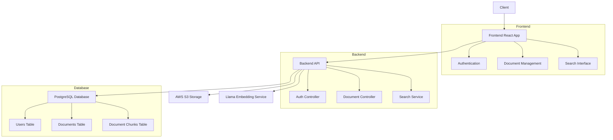
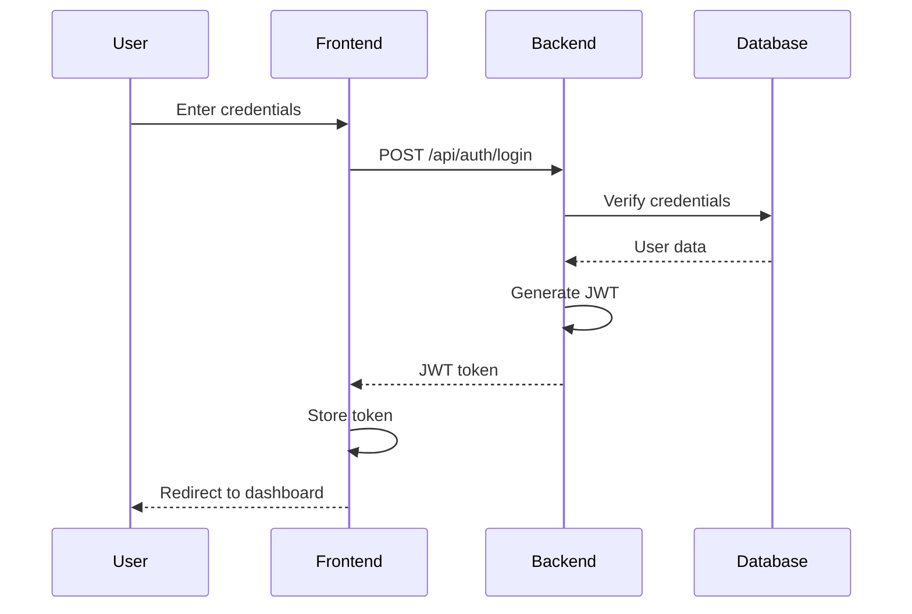
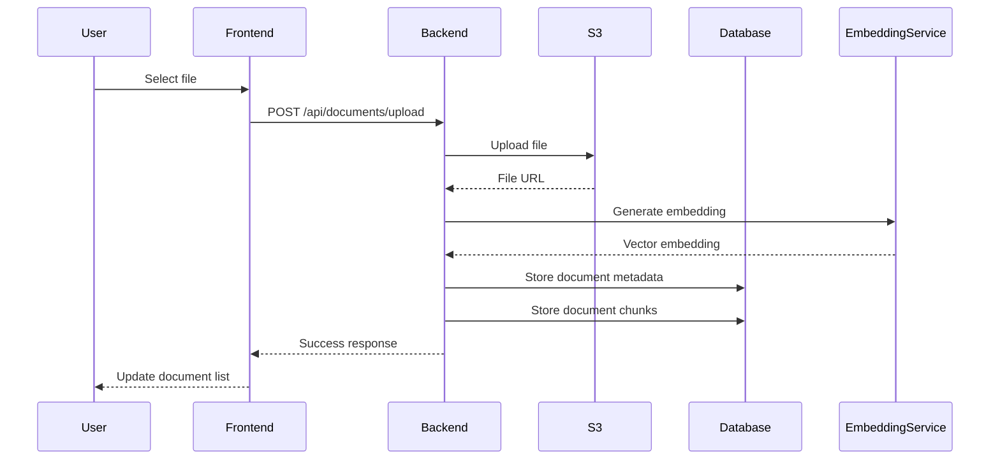
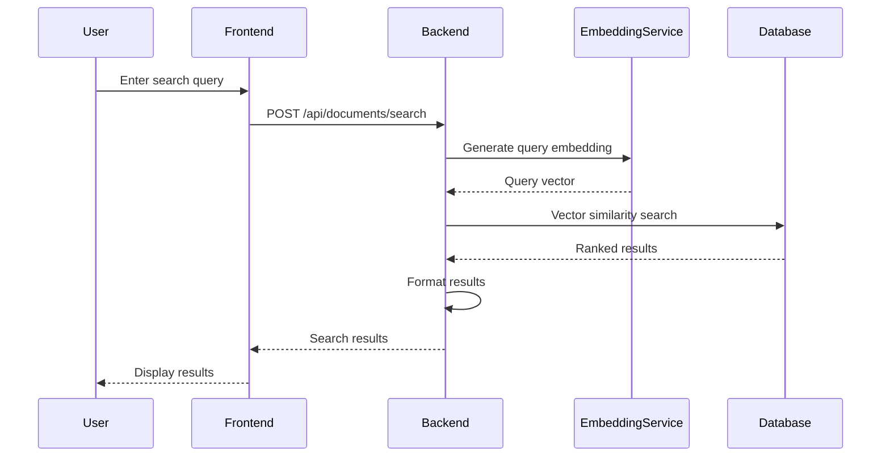
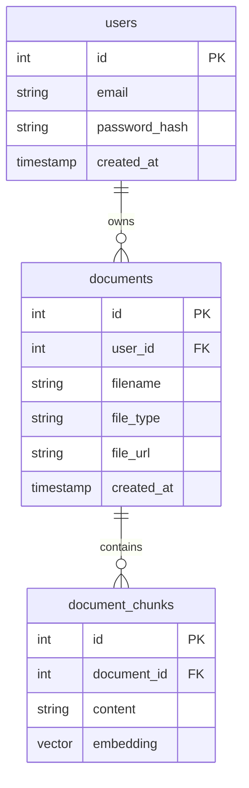
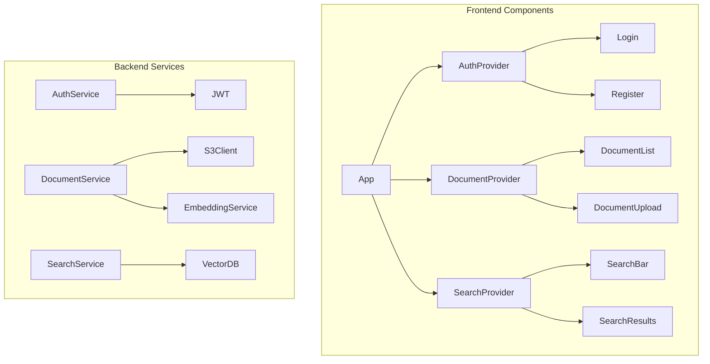
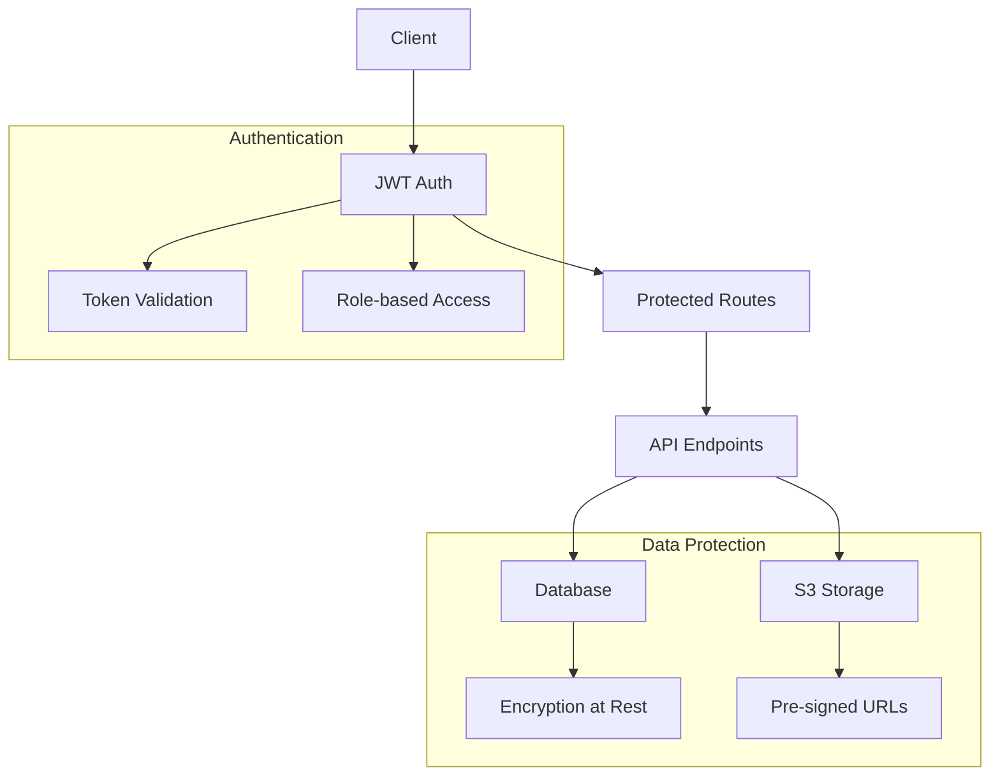
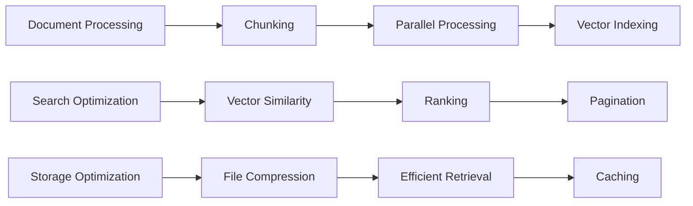

# Architecture Diagrams

## 1. System Overview

## 2. Authentication Flow

## 3. Document Upload Flow

## 4. Search Flow

## 5. Database Schema

## 6. Component Architecture

## 7. Security Architecture

## 8. Performance Optimization

These diagrams can be rendered using any Mermaid-compatible Markdown viewer. They illustrate:
1. Overall system architecture
2. Authentication flow
3. Document upload process
4. Search process
5. Database schema
6. Component architecture
7. Security measures
8. Performance optimizations 